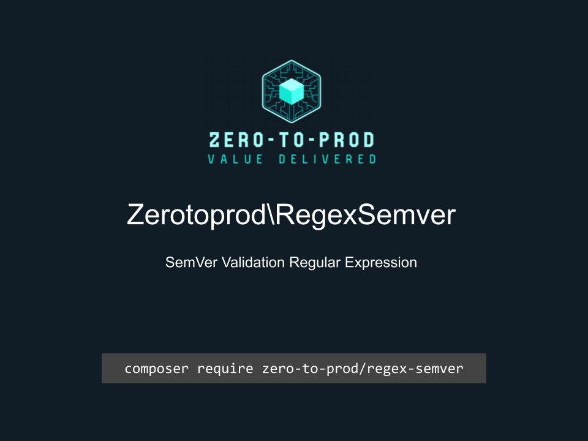

# Zerotoprod\RegexSemver



[](https://github.com/zero-to-prod/regex-semver)
[](https://github.com/zero-to-prod/regex-semver/actions)
[](https://github.com/zero-to-prod/regex-semver/actions)
[](https://packagist.org/packages/zero-to-prod/regex-semver/stats)
[](https://packagist.org/packages/zero-to-prod/regex-semver/stats)
[](https://packagist.org/packages/zero-to-prod/regex-semver)
[](https://github.com/zero-to-prod/regex-semver/blob/main/LICENSE.md)
[](https://wakatime.com/badge/github/zero-to-prod/regex-semver)
[](https://hitsofcode.com/github/zero-to-prod/regex-semver/view?branch=main)

## Contents

- [Introduction](#introduction)
- [Requirements](#requirements)
- [Installation](#installation)
- [Documentation Publishing](#documentation-publishing)
  - [Automatic Documentation Publishing](#automatic-documentation-publishing)
- [Usage](#usage)
- [Local Development](./LOCAL_DEVELOPMENT.md)
- [Contributing](#contributing)

## Introduction

A regular expression to check a SemVer string.

## Requirements

- PHP 7.1 or higher.

## Installation

Install `Zerotoprod\RegexSemver` via [Composer](https://getcomposer.org/):

```bash
composer require zero-to-prod/regex-semver
```

## Documentation Publishing

You can publish this README to your local documentation directory.

This can be useful for providing documentation for AI agents.

This can be done using the included script:

```bash
# Publish to default location (./docs/zero-to-prod/regex-semver)
vendor/bin/zero-to-prod-regex-semver

# Publish to custom directory
vendor/bin/zero-to-prod-regex-semver /path/to/your/docs
```

### Automatic Documentation Publishing

You can automatically publish documentation by adding the following to your `composer.json`:

```json
{
    "scripts": {
        "post-install-cmd": [
            "zero-to-prod-regex-semver"
        ],
        "post-update-cmd": [
            "zero-to-prod-regex-semver"
        ]
    }
}
```

## Usage

```php
Zerotoprod\RegexSemver\RegexSemver::pattern;
```

## Contributing

Contributions, issues, and feature requests are welcome!
Feel free to check the [issues](https://github.com/zero-to-prod/regex-semver/issues) page if you want to contribute.

1. Fork the repository.
2. Create a new branch (`git checkout -b feature-branch`).
3. Commit changes (`git commit -m 'Add some feature'`).
4. Push to the branch (`git push origin feature-branch`).
5. Create a new Pull Request.
