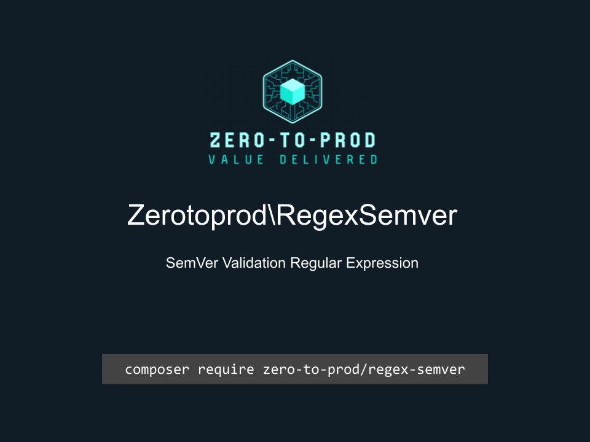

# Zerotoprod\RegexSemver



[](https://github.com/zero-to-prod/regex-semver)
[](https://github.com/zero-to-prod/regex-semver/actions)
[](https://packagist.org/packages/zero-to-prod/regex-semver/stats)
[](https://packagist.org/packages/zero-to-prod/regex-semver/stats)
[](https://packagist.org/packages/zero-to-prod/regex-semver)
[](https://github.com/zero-to-prod/regex-semver/blob/main/LICENSE.md)

A regular expression to check a SemVer string.

## Installation

Install the package via Composer:

```bash
composer require zero-to-prod/regex-semver
```

## Usage

```php
Zerotoprod\RegexSemver\RegexSemver::pattern;
```
